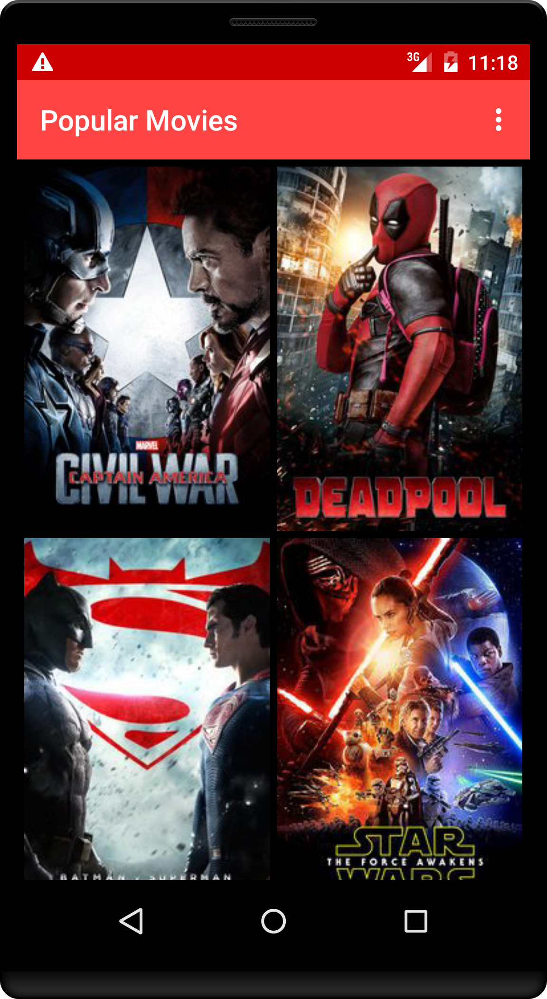
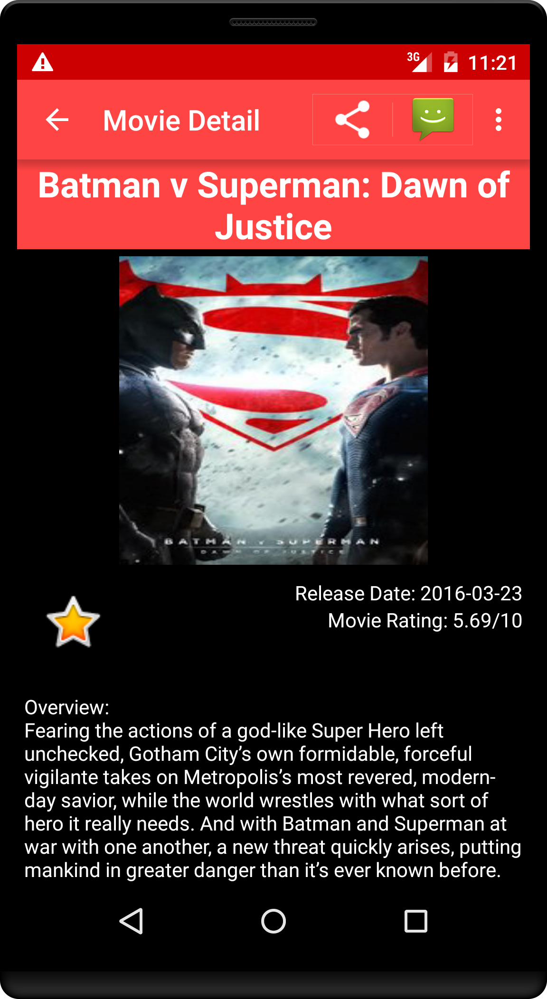
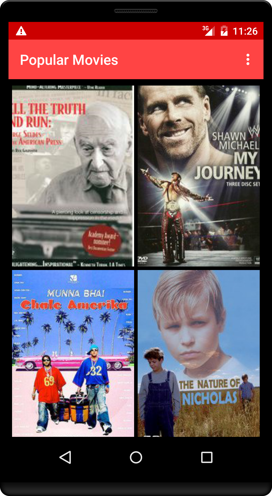
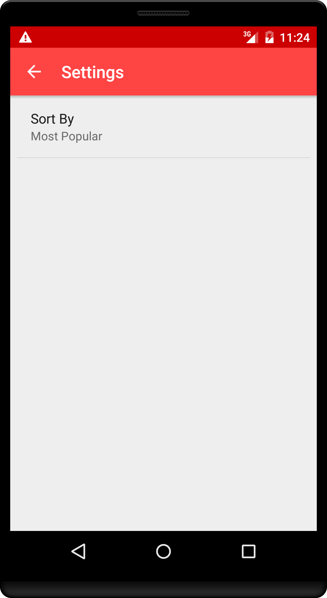

# Popular Movies

Stage 1 of Popular Movies app required to complete Udacity Android Developer Nanodegree.

## Features

With this app, you can:
* Discover the most popular or the highest rated movies
* In the movies detail screen you can view movie thumbnail, movie release date, movie rating and movie overview.

### Screenshots

## Libraries

* [Butterknife](http://jakewharton.github.io/butterknife/)- used for view injection
* [Picasso](http://square.github.io/picasso/)- an image loading and caching library

## API Key

This app uses [The Movie Database](https://www.themoviedb.org/documentation/api) API to retrieve movies.
You must provide your own API key in order to build the app. When you get it, just paste it to:
Gradle.properties
MyMovieDBApiKey="<YourAPIKey>"
